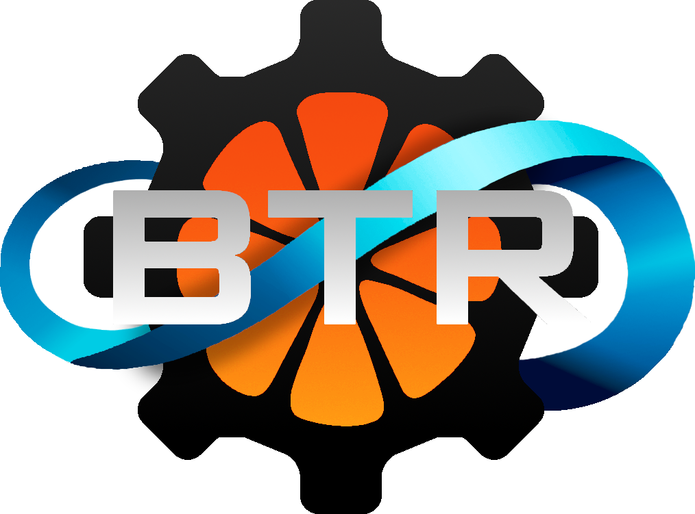

  
  
  

This is the coding template by Butler Tech Robotics, teams 325 and 144.

## What does it do?
BTRT (Butler Tech Robotics Template) Provides FIRST teams with a very strong coding base. Its capabilities are:

<ul>
<li> CTRE and Neo powered swerve drivetrains </li>
<li> April Tag field tracking using Limelight or PhotonVision </li>
<li> Full robot simulation with code replay </li>
<li> Logging for full match playback </li>
  </ul>

## Getting Started
[Getting Started](https://github.com/AydenLo17/BTRT/blob/main/docs/GETTING_STARTED.md)

## Credits

This project is heavily based on example code from Team 5712 - Hemlock's Gray Matter from their [AdvantageKitSwerveTemplate repository](https://github.com/Hemlock5712/AdvantageKitSwerveTemplate)
